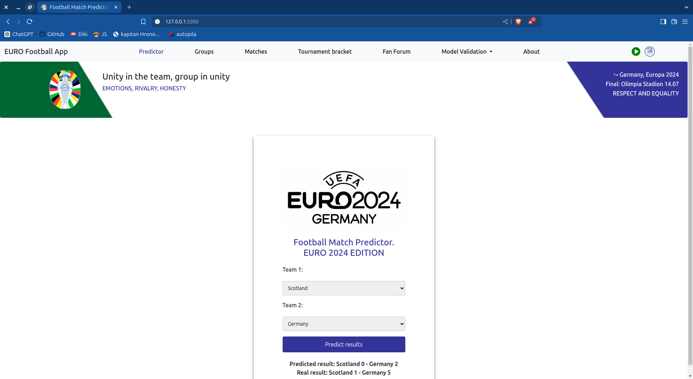
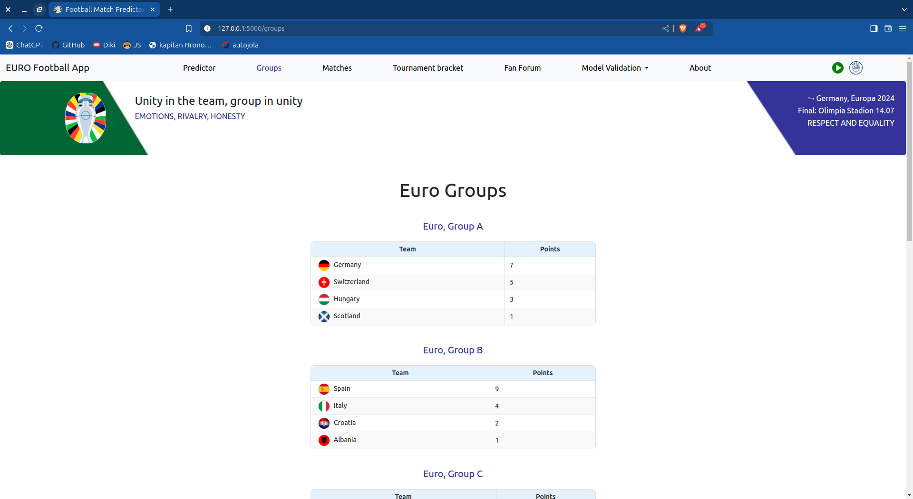
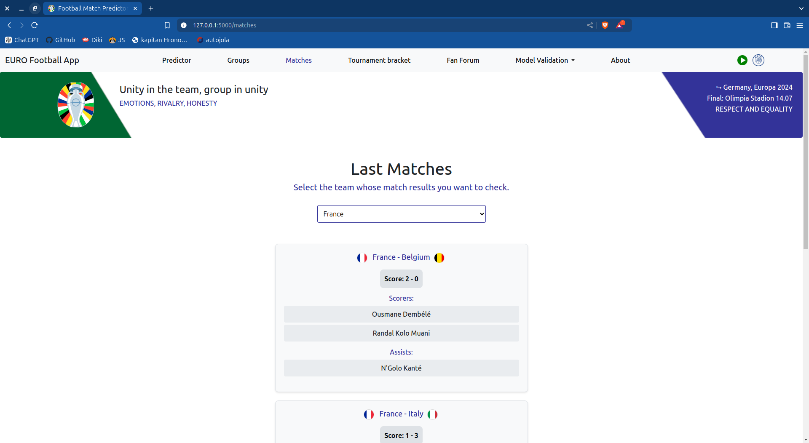
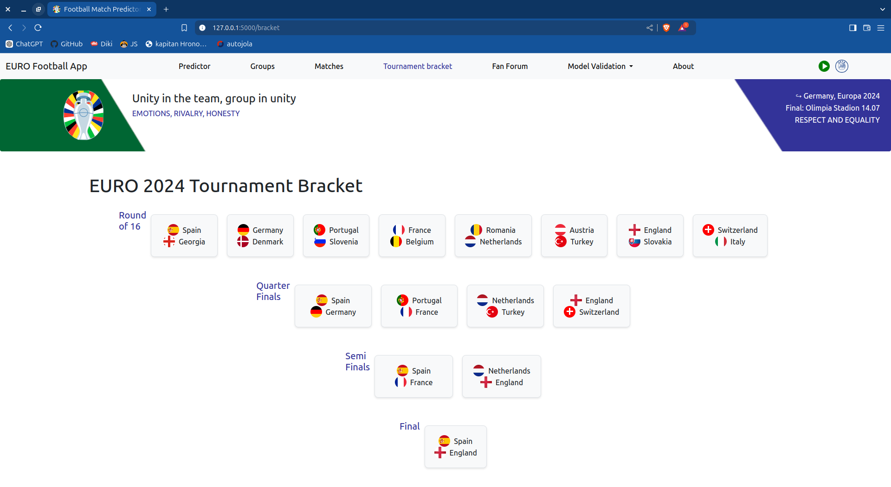
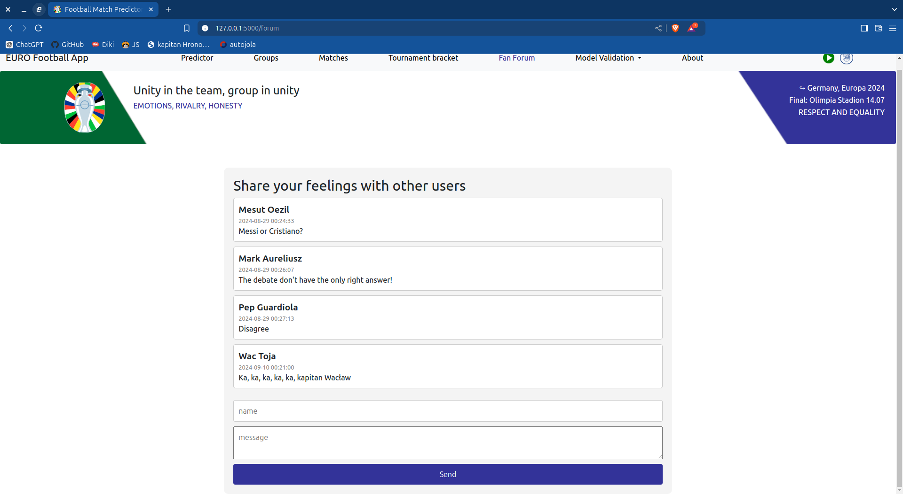
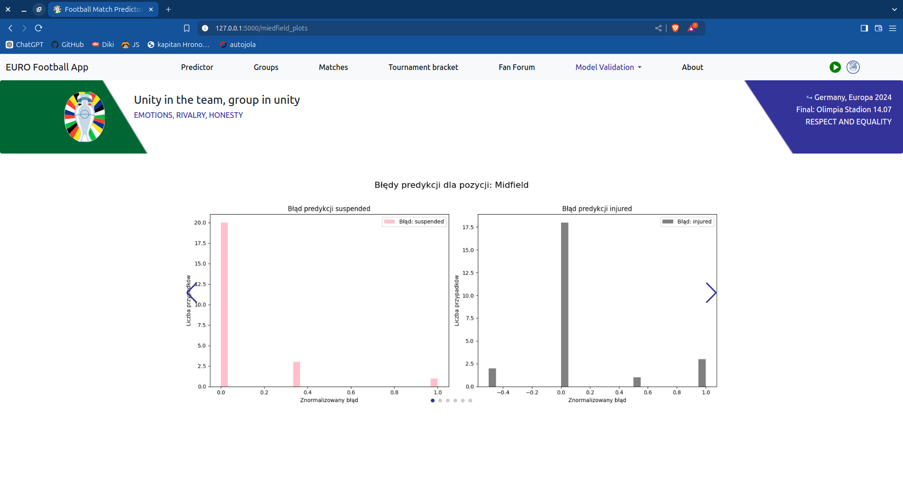
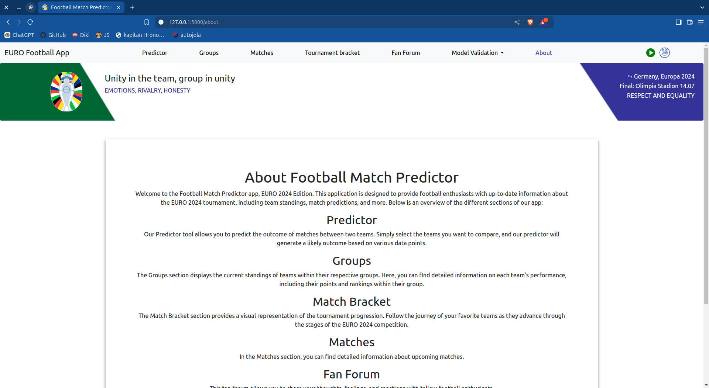

# Euro 2024 Football Predictor WebApp

## Overview

This project is a web application designed for people interested in Euro 2024 and football in general. 
It leverages ML algorithms- Random Forest to predict match outcomes and provides an interactive experience for users.

### Machine Learning Model Description

The database **euro_2024_stats.db** contains the cumulative statistics of players from teams participating in EURO 2024, categorized by position. The database is divided into two tables: one with player statistics from the club season before the tournament and the other with tournament statistics. 

- **First Model**: We used data from previous tournaments to predict the tournament statistics of teams based on club statistics.  
  - The first set of charts contains predicted statistics for each team, categorized by player position. The x-axis ranges from -1 to 1, where -1 represents the most underestimated case, and 1 represents the most overestimated case for each statistic.
  - **RMSE Chart**: This chart shows the Root Mean Square Error for each statistic, categorized by player position.

- **Second Model**: We predict the EURO 2024 results based on the club statistics of players, categorized by position, using historical data from past tournaments.
  - The first set of charts contains predicted goals scored and predicted goals conceded by each team, with the margin of error taken into account.
  - The second set of charts contains predicted results with the correctly predicted winner, the exact score, and incorrect results for each team.
  - The third set of charts contains the Root Mean Square Error for each team, categorized by predicted goals scored and conceded.

## Features

- **Match Prediction**: Utilize machine learning algorithms, such as Random Tree, to predict, forecast match results.
- **Interactive Interface**: Navigate through an intuitive user interface with dynamic elements and responsive design.
- **Data Analysis**: Analyze and visualize data related to Euro 2024 matches.

## Some technologies we already used

- **Flask**
- **Jinja2**
- **Navbar**
- **Bootstrap**
- **SQLite**
- **SQLAlchemy**
- **JavaScript**
- **Pandas**
- **Sklearn**
- **BeautifulSoup4 (bs4)**
- **Selenium**
- **Asyncio**

## Introduction









## Installation

To get started with the project, follow these steps:

1. **Clone the Repository**

   ```bash
   git clone https://github.com/gawelszymon/Football_Predictor_WebApp.git
   cd Football_Predictor_WebApp
